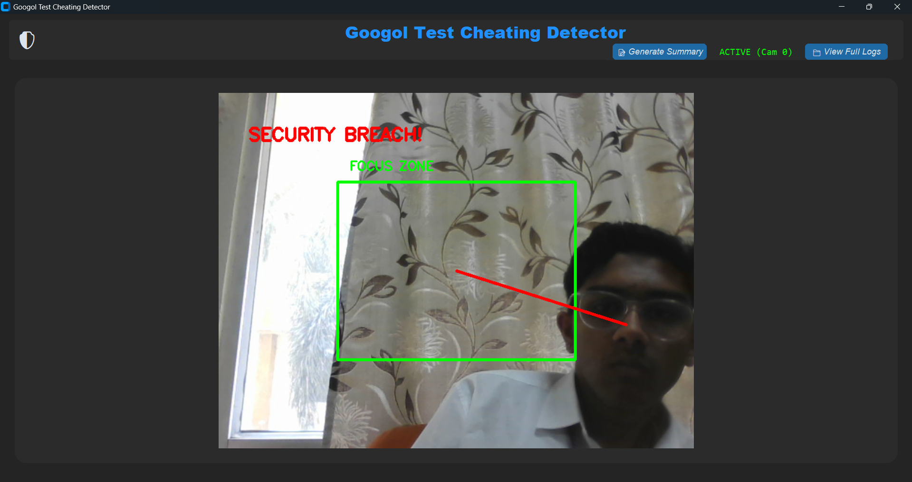
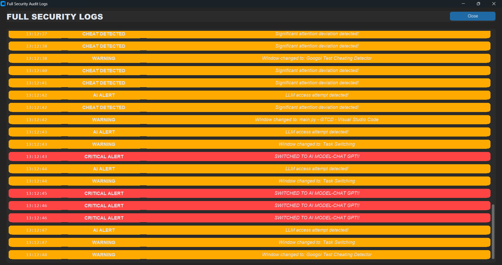
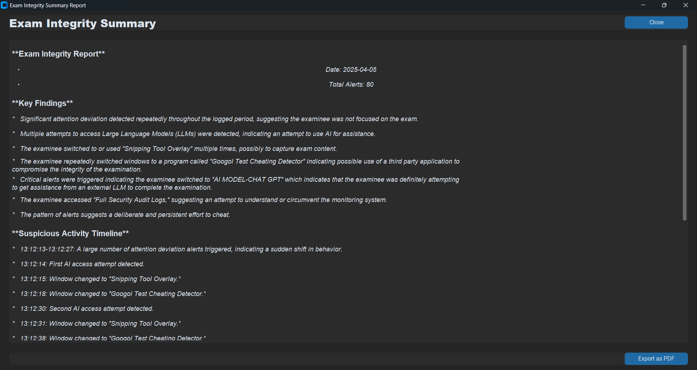
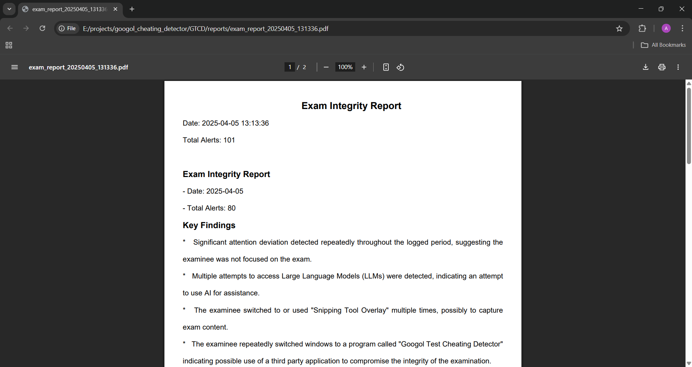
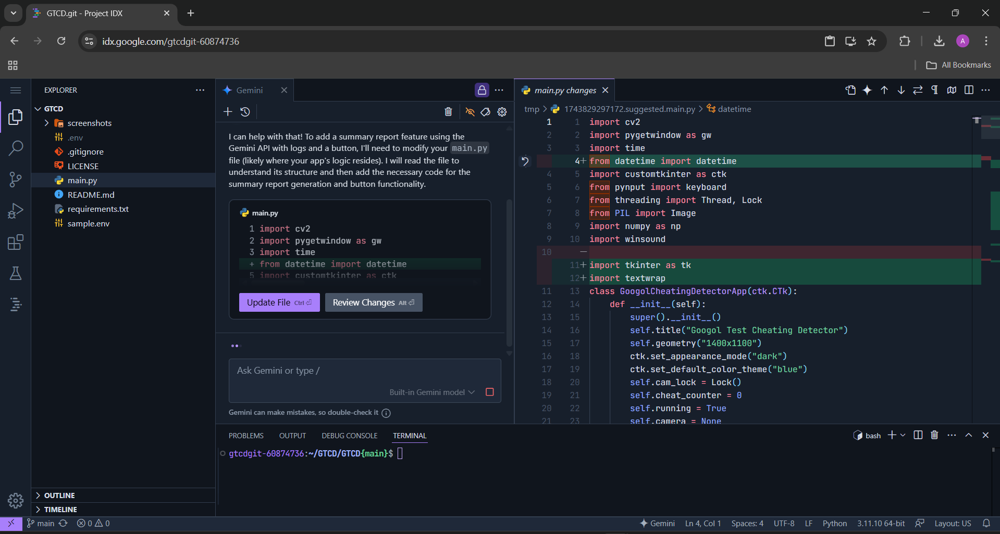

# Googol Test Cheating Detector 🛡️


A sophisticated AI-powered cheating detection system for online exams and tests that monitors:
- Screen activity (window switching)
- Keyboard shortcuts (potential LLM access attempts)
- Visual attention (face and eye tracking)
- Physical presence (camera monitoring)
- Reports (automated summaries and PDF generation)
- Audible alerts (for immediate attention)
- Timestamped logs (detailed activity history)

## Team Information 👥

**Team Name**: Googol  
**Members**:
- Arun Pranav A T
- Navdeep R

## Features ✨

### Real-time Monitoring
- 🖥️ **Window Activity Tracking** - Detects browser/application switching
- ⌨️ **Keyboard Shortcut Monitoring** - Flags potential LLM access attempts
- 👁️ **Visual Attention Analysis** - Tracks face position and focus
- 📷 **Camera Feed Integration** - Live monitoring with focus zone visualization

### Advanced Detection
- 🔍 **Face Detection** - Using OpenCV Haar cascades
- 📊 **Behavior Analysis** - Measures attention deviation from focus zone
- 🚨 **Multi-level Alerts** - Visual, auditory, and log-based warnings
- 🔔 **Audible Alerts** - Immediate notification for suspicious activity

### Reporting & Analytics
- 📝 **Automated Summary Generation** - Powered by Gemini AI
- 📄 **PDF Report Export** - Comprehensive exam integrity reports
- ⏱️ **Timestamped Logging** - Detailed activity history

## Google Tools Used 🛠️

This project leverages several Google technologies to enhance functionality and development:

### Gemini API
- **Usage**: Powers the AI-generated exam integrity summaries
- **Functionality**:
  - Analyzes log patterns to detect cheating trends
  - Generates comprehensive reports with key findings
  - Provides natural language processing for readable insights
- **Integration**: Through `google-generativeai` Python package

### Google IDX
- **Usage**: Primary development environment
- **Benefits**:
  - Cloud-based IDE for seamless coding from any device
  - Integrated Gemini code assistance for development
  - Pre-configured Python environment

### Google Cloud Platform
- **Usage**: Project hosting and deployment
- **Components**:
  - Cloud Run for containerized application hosting
  - Cloud Storage for report PDF archival

## Prerequisites & System Requirements 💻

### Essential Requirements
- **Operating System**: Windows 10/11 (Linux/macOS support possible with modifications)
- **Python**: 3.8 or higher
- **Webcam**: Required for visual monitoring (720p or higher recommended)
- **Google Gemini API Key**: Required for AI-powered summary generation ([Get API key](https://ai.google.dev/))

### Recommended Specifications
- **CPU**: Intel i5 or equivalent (4 cores minimum)
- **RAM**: 8GB+ for optimal performance
- **Permissions**: Administrator rights recommended for full monitoring capabilities
- **Display**: 1920×1080 resolution (single monitor setup)
- **Lighting**: Well-lit environment for accurate face detection

### Software Dependencies
- OpenCV 4.5+ for computer vision
- CustomTkinter 5.2+ for modern UI
- PyGetWindow for activity monitoring
- FPDF for report generation

> **Note**: For Linux/macOS systems, additional configuration may be required for:
> - Camera access permissions
> - Alternative sound notification systems
> - Window management libraries

## Installation ⚙️

1. Clone the repository:
   ```bash
   git clone https://github.com/navdeep-r/GTCD.git
   cd GTCD
   ```

2. Install dependencies:
   ```bash
   pip install -r requirements.txt
   ```

3. Create `.env` file with your Gemini API key:
   ```env
   GEMINI_API_KEY=your_api_key_here
   ```

## Usage 🚀

1. Run the application:
   ```bash
   python main.py
   ```

2. System will automatically:
   - Detect and initialize camera
   - Begin monitoring keyboard and window activity
   - Display real-time camera feed with focus zone
   - Log all suspicious activity
   - Trigger alerts for any detected cheating attempts
   - Generate PDF report upon completion

3. View detailed logs by clicking "View Full Logs" button

4. Generate PDF report by clicking "Generate Report" button
   - Report will be saved in the `reports/` directory

## Screenshots 📸


*Main monitoring interface with camera feed and live logs*


*Real-time cheating detection alert*


*Sample report generated with Gemini AI*


*Generated PDF report with detailed activity summary*


*Code editor used is Google IDX*

## Configuration ⚙️

Modify these parameters in the code for customization:
- `focus_area` in `GoogolCheatingDetectorAI` - Adjust the acceptable face position zone
- `distance` threshold - Change sensitivity for attention deviation
- `cheat_counter` warning frequency - Modify how often audible alerts trigger

## Limitations ⚠️

- Currently optimized for single-monitor setups
- Requires well-lit environment for face detection
- May trigger false positives with certain applications
- Windows-specific sound alerts (winsound)

## License 📜

This project is licensed under the MIT License - see the [LICENSE](LICENSE) file for details.

## Contributing 🤝

Contributions are welcome! Please open an issue or pull request for any improvements.

## Directory Structure 📂

```
GTCD/
├── reports/                   # Generated PDF reports
├── screenshots/               # Application screenshots
|     ├── interface.png
|     ├── report.png
|     ├── saved_pdf.png
|     ├── google_idx.png
|     ├── export.png
|     └── alert.png
├── .env                       # Environment variables
├── .gitignore
├── build.py                   # Used to build the application
├── gtcd.ico                   # Icon for the application
├── LICENSE
├── main_for_build.py          # Application code for build version which asks users to enter the Gemini API key
├── main.py                    # Main application code
├── README.md
├── requirements.txt           # Python dependencies
└── sample.env                 # Example environment file
```